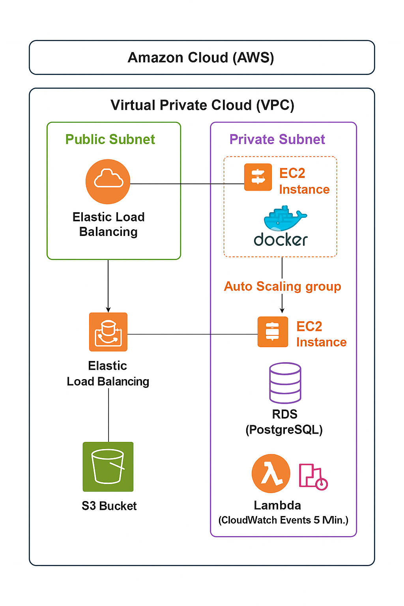

# GroceryMate

## 🏆 GroceryMate E-Commerce Platform

[](https://www.python.org/)
[](https://www.kernel.org/)
[](https://www.postgresql.org/)
[](https://github.com/AlejandroRomanIbanez/AWS_grocery/releases/tag/v2.0.0)
[](#-license)

⭐ **Star us on GitHub** — it motivates us a lot!

---

## 📌 Table of Contents

- [Overview](#-overview)
- [Features](#-features)
- [Screenshots & Demo](#-screenshots--demo)
- [Prerequisites](#-prerequisites)
- [Installation](#-installation)
  - [Clone Repository](#-clone-repository)
  - [Configure PostgreSQL](#-configure-postgresql)
  - [Populate Database](#-populate-database)
  - [Set Up Python Environment](#-set-up-python-environment)
  - [Set Environment Variables](#-set-environment-variables)
  - [Start the Application](#-start-the-application)
- [Usage](#-usage)
- [Contributing](#-contributing)
- [License](#-license)

## 🚀 Overview

GroceryMate is an application developed as part of the Masterschools program by **Alejandro Roman Ibanez**. It is a modern, full-featured e-commerce platform designed for seamless online grocery shopping. It provides an intuitive user interface and a secure backend, allowing users to browse products, manage their shopping basket, and complete purchases efficiently.

GroceryMate is a modern, full-featured e-commerce platform designed for seamless online grocery shopping. It provides an intuitive user interface and a secure backend, allowing users to browse products, manage their shopping basket, and complete purchases efficiently.

## 🛒 Features

- **🛡️ User Authentication**: Secure registration, login, and session management.
- **🔒 Protected Routes**: Access control for authenticated users.
- **🔎 Product Search & Filtering**: Browse products, apply filters, and sort by category or price.
- **⭐ Favorites Management**: Save preferred products.
- **🛍️ Shopping Basket**: Add, view, modify, and remove items.
- **💳 Checkout Process**:
  - Secure billing and shipping information handling.
  - Multiple payment options.
  - Automatic total price calculation.



🚀 GroceryMate AWS with Terraform

This project automates the deployment of a production-ready, scalable AWS infrastructure 
for the GroceryMate e-commerce application using Terraform.

🏗️ Architecture Overview

The system is built on a secure, multi-tier architecture within an Amazon VPC:

● Web Tier (Public Subnets):
   ○ Application Load Balancer (ALB) distributes incoming user traffic.
   ○ EC2 Instances in an Auto Scaling Group run the GroceryMate app 
     inside Docker containers, ensuring high availability and scalability.

● Data & Logic Tier (Private Subnets):
  ○ Amazon RDS (PostgreSQL) manages the application database securely, 
    isolated from the public internet.
  ○ AWS Lambda function performs periodic health checks, triggered every 
    5 minutes by Amazon CloudWatch Events.

● Storage & Assets:

  ○ Amazon S3 is used for storing static assets and backups.


• VPC (Virtual Private Cloud): Your isolated network within AWS.
• Public Subnets: "Rooms" with internet access, hosting the Load Balancer.
• Private Subnets: "Rooms" shielded from the internet, hosting backend EC2 instances and the RDS database for added security.
• EC2 Instances: Virtual servers that run the GroceryMate application inside Docker containers.
• ALB (Application Load Balancer): Acts as a traffic cop, routing user requests to healthy EC2 instances.
• RDS (PostgreSQL): The managed database service storing all application data.
• S3 Bucket: Cloud storage for static files like images.
• Lambda Function: A serverless function that automatically checks the health of your application.
• EventBridge: A scheduler that triggers the Lambda function at regular intervals.

⚠️ Important Note on NAT Gateway:
A NAT Gateway allows resources in private subnets to access the internet (e.g., for software updates).
While the Terraform code is included in modules/main_vpc.tf, it is currently commented out.

Reason: Creating a NAT Gateway requires the ec2:AllocateAddress permission, which is often
restricted on student AWS accounts.

Workaround: For this project, a NAT Gateway was manually created via the AWS Console. If you have full admin
permissions, you can uncomment the relevant code to create it automatically with Terraform.


Project Structure

AWS_grocery_version2/
├── backend/                 # Backend application code (Python/Flask)
├── docs/                    # Architecture diagrams and documentation
├── frontend/                # Frontend application code (React/JavaScript)
├── infrastructure/
│   └── my_terraform_project/
│       ├── modules/         # Reusable Terraform modules (ALB, EC2, RDS, etc.)
│       ├── scripts/
│       │   ├── install_docker.sh           # Script to install Docker on EC2
│       │   └── lambda_health_check_template.py # Lambda function code template
│       ├── build_lambda_zip.sh    # Script to package Lambda code for deployment
│       ├── main.tf          # Main Terraform configuration
│       ├── variables.tf     # Input variable definitions
│       ├── outputs.tf       # Output values (e.g., ALB URL)
│       └── terraform.tfvars.example # Example variables file (copy to terraform.tfvars)
└── README.md

his infrastructure provides a fault-tolerant and secure foundation 
for deploying modern web applications on AWS.

## 📸 Screenshots & Demo


https://github.com/user-attachments/assets/d1c5c8e4-5b16-486a-b709-4cf6e6cce6bc

## 📋 Prerequisites

Ensure the following dependencies are installed before running the application:

- **🐍 Python (>=3.11)**
- **🐘 PostgreSQL** – Database for storing product and user information.
- **🛠️ Git** – Version control system.

## ⚙️ Installation

### 🔹 Clone Repository

```sh
git clone --branch version2 https://github.com/AlejandroRomanIbanez/AWS_grocery.git && cd AWS_grocery
```

### 🔹 Configure PostgreSQL

Before creating the database user, you can choose a custom username and password to enhance security. Replace `<your_secure_password>` with a strong password of your choice in the following commands.

Create database and user:

```sh
psql -U postgres -c "CREATE DATABASE grocerymate_db;"
psql -U postgres -c "CREATE USER grocery_user WITH ENCRYPTED PASSWORD '<your_secure_password>';"  # Replace <your_secure_password> with a strong password of your choice
psql -U postgres -c "ALTER USER grocery_user WITH SUPERUSER;"
```

### 🔹 Populate Database

```sh
psql -U grocery_user -d grocerymate_db -f backend/app/sqlite_dump_clean.sql
```

Verify insertion:

```sh
psql -U grocery_user -d grocerymate_db -c "SELECT * FROM users;"
psql -U grocery_user -d grocerymate_db -c "SELECT * FROM products;"
```

### 🔹 Set Up Python Environment


Install dependencies in an activated virtual Enviroment:

```sh
cd backend
pip install -r requirements.txt
```
OR (if pip doesn't exist)
```sh
pip3 install -r requirements.txt
```

### 🔹 Set Environment Variables

Create a `.env` file:

```sh
touch .env  # macOS/Linux
ni .env -Force  # Windows
```

Generate a secure JWT key:

```sh
python3 -c "import secrets; print(secrets.token_hex(32))"
```

Update `.env`:

```sh
nano .env
```

Fill in the following information (make sure to replace the placeholders):

```ini
JWT_SECRET_KEY=<your_generated_key>
POSTGRES_USER=grocery_user
POSTGRES_PASSWORD=<your_password>
POSTGRES_DB=grocerymate_db
POSTGRES_HOST=localhost
POSTGRES_URI=postgresql://${POSTGRES_USER}:${POSTGRES_PASSWORD}@${POSTGRES_HOST}:5432/${POSTGRES_DB}
```

### 🔹 Start the Application

```sh
python3 run.py
```

## 📖 Usage

- Access the application at [http://localhost:5000](http://localhost:5000)
- Register/Login to your account
- Browse and search for products
- Manage favorites and shopping basket
- Proceed through the checkout process

## 🤝 Contributing

We welcome contributions! Please follow these steps:

1. Fork the repository.
2. Create a new feature branch (`feature/your-feature`).
3. Implement your changes and commit them.
4. Push your branch and create a pull request.

## 📜 License

This project is licensed under the MIT License.


